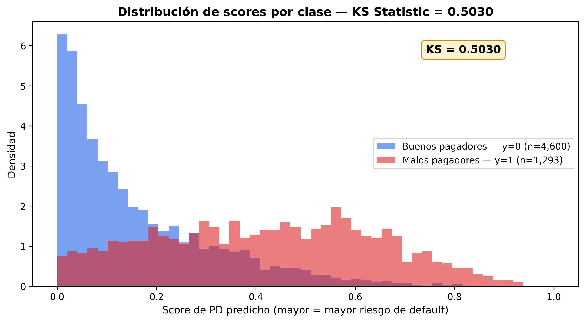
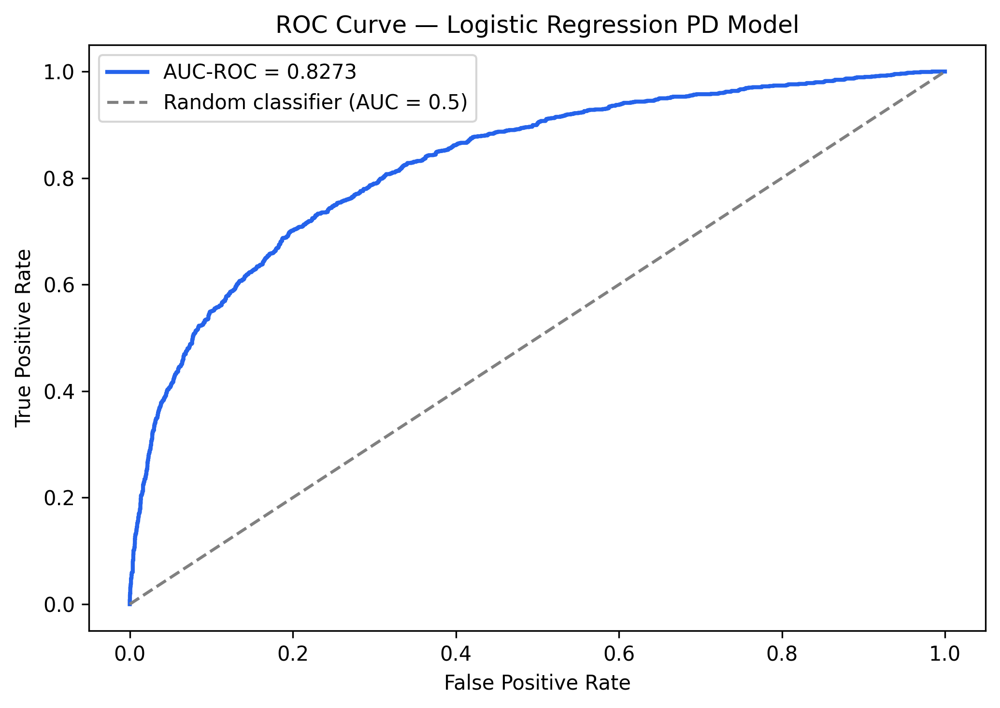
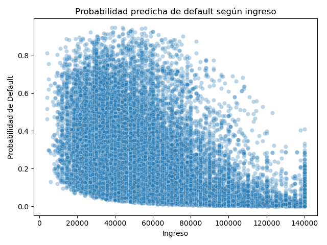
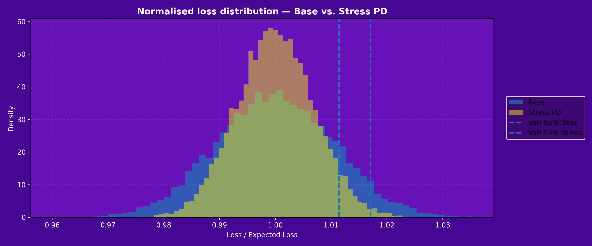
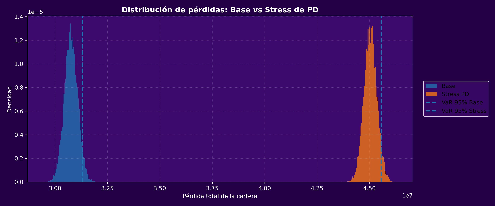

# Credit Risk & Monte Carlo Portfolio Analysis


Análisis de riesgo crediticio **end-to-end**: desde la estimación de la probabilidad individual de default con Machine Learning, hasta la distribución de pérdidas de cartera bajo escenarios de stress mediante simulación Monte Carlo.

> 🚀 **Demo interactiva en vivo:** [credit-risk-montecarlo-analysis-maida-beltran.streamlit.app](https://credit-risk-montecarlo-analysis-maida-beltran.streamlit.app/)
> Parametrizá el portafolio y ejecutá simulaciones Monte Carlo en tiempo real con visualizaciones de Plotly.

Proyecto desarrollado con **Spec-Driven Development**: cada stage del pipeline parte de una especificación formal en `specs/` antes de implementarse.

---

## ¿Qué hace este proyecto?

Pipeline completo de credit risk modeling sobre el [Credit Risk Dataset de Kaggle](https://www.kaggle.com/datasets/laotse/credit-risk-dataset):

1. **Preprocesamiento y EDA** — limpieza de tipos, valores faltantes, outliers (winsorización por IQR).
2. **Estimación de PD individual (Machine Learning)** — modelo de clasificación supervisada (regresión logística) entrenado con scikit-learn / statsmodels, validación de significancia con test t de Welch, scoring `pd_hat` exportado.
3. **Simulación Monte Carlo** — 10.000 escenarios de pérdida de cartera (Bernoulli por préstamo).
   > *Motor de simulación 100% vectorizado con NumPy: genera matrices de (n_simulaciones × n_exposiciones) en memoria, eliminando bucles Python. Escala a portafolios de 10.000+ exposiciones manteniendo tiempos de ejecución sub-segundo.*
4. **Métricas de riesgo** — Expected Loss, VaR 95%/99%, Expected Shortfall (Basel III).
5. **Stress testing** — impacto de deterioro de PD (×1.5) sobre toda la distribución de pérdidas, con Common Random Numbers (CRN) para reducción de varianza.
6. **Descomposición de EL** — contribución por quintil de PD (EL = PD × EAD × LGD).
7. **Dashboard interactivo** — app Streamlit + Plotly para exploración paramétrica.

---

## Resultados (cartera base vs. estrés)

Métricas de riesgo obtenidas sobre la distribución simulada de pérdidas (10.000 simulaciones):

| Métrica | Base | Estrés (PD ×1.5) | Δ % |
|---|---|---|---|
| **Expected Loss** | 30.75 M | 45.04 M | +46.5% |
| **VaR 95%** | 31.29 M | 45.55 M | +45.6% |
| **Expected Shortfall 95%** | 31.43 M | 45.68 M | +45.4% |
| **VaR 99%** | 31.51 M | — | — |

> El stress testing con CRN aísla el impacto real del deterioro de PD del ruido de simulación, mostrando un aumento de ~46% en la pérdida esperada de la cartera.

### Validación del modelo

| Métrica | Valor | Benchmark |
|---|---|---|
| **KS Statistic** | 0.503 | Estándar bancario ARG: >0.30 aceptable |
| **KS p-value** | < 0.001 | < 0.05 → separación estadísticamente significativa |
| **AUC-ROC** | 0.8273 | Baseline random: 0.50 |

Validación sobre hold-out set (20%, split estratificado) para garantizar métricas out-of-sample. El scoring final (`pd_hat`) se refitea sobre el dataset completo para maximizar el poder predictivo en la simulación.

---

## Galería de outputs

**Separación de scores por clase (KS) y curva ROC** — gráficos centrales de validación:




**Probabilidad de default estimada vs. ingreso:**



**Distribución de pérdidas de cartera — base vs. estrés:**




---

## Estructura del proyecto

```
credit-risk-montecarlo-analysis/
├── app.py                   ← Dashboard interactivo (Streamlit + Plotly)
├── specs/                   ← Especificaciones (Spec-Driven Development)
├── src/credit_risk/         ← Paquete Python
│   ├── config.py            ← Parámetros centralizados (MonteCarloConfig, Paths)
│   ├── preprocessing.py     ← Stages 1-3: ingesta, EDA, outliers
│   ├── model.py             ← Stage 4: regresión logística, estimación PD
│   ├── visualization.py     ← Stage 5: gráficos de inferencia
│   ├── monte_carlo.py       ← Stage 6: simulación Monte Carlo
│   └── risk_decomposition.py← Stage 7: descomposición EL por quintil de PD
├── scripts/
│   └── run_pipeline.py      ← Entry point — ejecuta el pipeline completo
├── notebooks/
│   └── exploracion_completa.ipynb ← EDA interactivo
├── tests/
│   ├── test_model.py        ← Tests para estimación de PD
│   └── test_monte_carlo.py  ← Tests para simulación Monte Carlo
├── data/                    ← No versionado (ver data/README.md)
└── output/                  ← Tablas y gráficos generados
    ├── figures/             ← Gráficos de inferencia y validación
    └── monte_carlo/         ← Distribuciones de pérdida y métricas de riesgo
```

---

## Instalación y configuración

### Requisitos

- Python 3.12+
- [uv](https://astral.sh/uv/) (recomendado)

### Setup en Windows

```powershell
# 1. Instalar uv (si no lo tenés)
powershell -ExecutionPolicy ByPass -c "irm https://astral.sh/uv/install.ps1 | iex"

# 2. Clonar el repositorio
git clone https://github.com/maidabeltran0-png/credit-risk-montecarlo-analysis.git
cd credit-risk-montecarlo-analysis

# 3. Instalar dependencias
uv sync

# 4. Descargar el dataset de Kaggle y guardarlo en:
#    data/raw/credit_risk_dataset.csv
#    (ver data/README.md para el link)
```

---

## Cómo ejecutar

### Pipeline completo (recomendado)

```powershell
uv run python scripts/run_pipeline.py
```

Ejecuta los 7 stages en orden y genera todos los archivos en `output/`.

### Dashboard interactivo (Streamlit)

```powershell
# Instalar el proyecto en modo editable y dependencias
uv pip install -e .

# Lanzar la aplicación
uv run streamlit run app.py
```

### EDA interactivo

```powershell
uv run jupyter lab notebooks/exploracion_completa.ipynb
```

### Tests

```powershell
uv run pytest tests/ -v
```

---

## Contexto financiero

| Métrica | Qué mide |
|---|---|
| **Expected Loss (EL)** | Pérdida promedio esperada de la cartera |
| **VaR 95%** | Pérdida máxima con 95% de confianza |
| **Expected Shortfall (ES)** | Pérdida promedio en los peores escenarios (más allá del VaR) |

El modelo estima la **Probability of Default (PD)** individual con regresión logística y la combina con la **Exposure at Default (EAD)** y la **Loss Given Default (LGD = 45%)** para calcular la pérdida esperada individual:

> **EL_i = PD_i × EAD_i × LGD**

La simulación Monte Carlo repite este proceso 10.000 veces para obtener la **distribución completa de pérdidas de cartera**.

### Common Random Numbers (CRN) en Stress Testing

Para comparar escenarios (Base vs. Estrés), el motor de simulación implementa **Common Random Numbers (CRN)**, una Técnica de Reducción de Varianza (VRT). El principio es:

> Si un crédito "defaultea" con una extracción aleatoria U=0.62 en el escenario base, también "defaulteará" en el escenario estresado (porque su PD estresada es mayor). Estamos comparando *el mismo portafolio en condiciones distintas*, no dos realizaciones aleatorias distintas.

La varianza del estimador de la diferencia `Pérdida_Estrés - Pérdida_Base` se reduce porque los dos procesos están correlacionados positivamente:

```text
Var(X_estrés - X_base) = Var(X_estrés) + Var(X_base) - 2·Cov(X_estrés, X_base)
```

Al usar CRN, la covarianza es positiva (`Cov > 0`), reduciendo la varianza total del comparador. Esta técnica es estándar en stress testing bajo **Basilea III** y marcos **DFAST/CCAR** para aislar el impacto real del estrés del ruido de simulación, especialmente en métricas de cola (VaR y Expected Shortfall).

---

## Stack técnico

**Lenguaje:** Python 3.12

**Data & ML:** pandas · numpy · scikit-learn · statsmodels · scipy

**Visualización:** matplotlib · seaborn · lets-plot · Plotly

**App & deploy:** Streamlit

**Workflow:** uv (gestión de dependencias) · pytest (testing) · ruff (linting) · Spec-Driven Development

---

## Roadmap

- [x] Estimación de PD con Machine Learning (regresión logística) y validación KS / AUC-ROC
- [x] Motor Monte Carlo vectorizado (10.000 simulaciones)
- [x] Stress testing con Common Random Numbers (CRN)
- [x] Dashboard interactivo con Streamlit + Plotly (deployado en la nube)
- [ ] Auditoría de datos faltantes y pipeline de imputación
- [ ] Escenarios adverso vs. severamente adverso parametrizables

---

## Autora

**Maida Beltrán** — Economía (UBA) · Análisis de Datos · Machine Learning · Riesgo Cuantitativo

[LinkedIn](https://linkedin.com/in/maida-beltran) · [GitHub](https://github.com/maidabeltran0-png)
